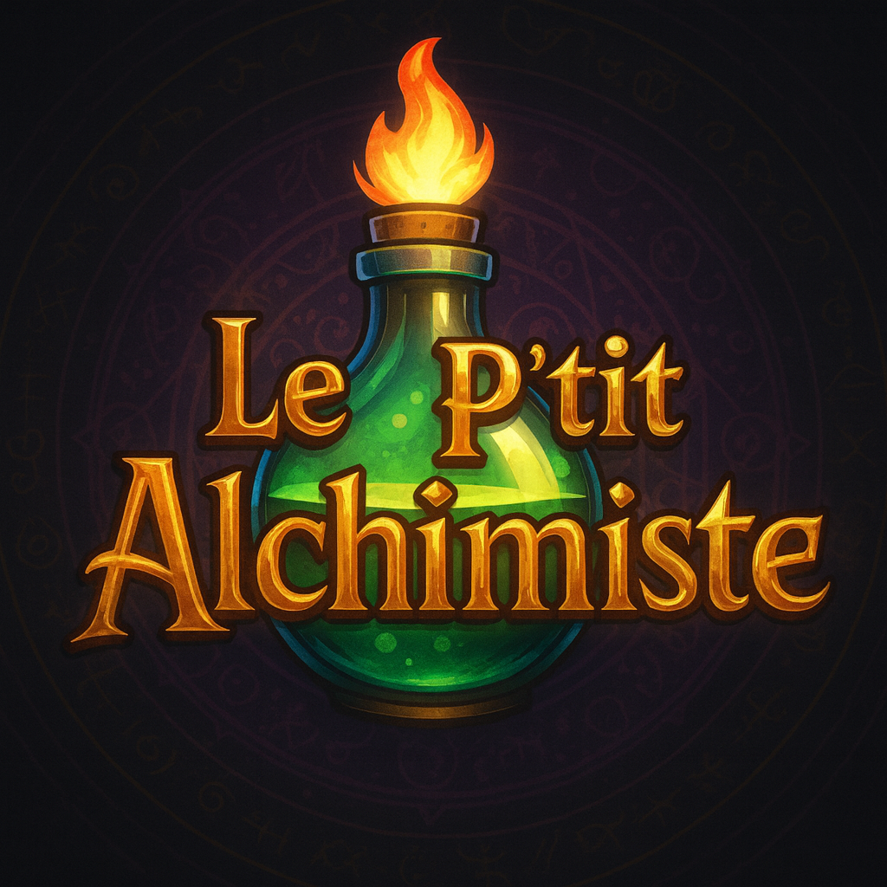

# **Le P’tit Alchimiste**  
### *From Kartoffel Magique Studio*

## **📌 Overview**
**Le P’tit Alchimiste** is an immersive **VR laboratory & alchemy-learning experience** built with **Unity** and the **XR Interaction Toolkit**.  
The project aims to make chemistry more accessible, safe, and engaging for young learners by blending **scientific rigor** with a **fantasy-inspired alchemical universe**.

Players can grab objects, mix reactants, trigger visual chemical reactions, pour liquids, use pH strips, light candles, and move naturally inside a medieval-style virtual workshop.

The main scene to build is: **`Main`**

---

## **🎮 Core Interactions**

### **🕹️ Locomotion**
- **Left joystick:** Physical movement  
- **Right joystick:** Camera rotation  
- **Teleportation:** Push and hold the **left joystick forward**, then release to instantly warp to the highlighted location  

### **🖐️ Object Handling**
Players can interact with:
- Flasks, jars, and beakers  
- Solid ingredients and metal powders  
- pH strips  
- A candle that reacts to different metals  
- Tools and interactive props  

Objects are grabbed using the VR controller trigger, following Meta XR Core SDK interaction standards.

### **📖 Tutorial Book**
A stylized **medieval recipe book** guides players:
- Open the book with the **right trigger**  
- Close it with the **left trigger**  
- Navigate pages with hand-drawn arrows  

### **💧 Liquid System**
Custom liquid physics simulate:
- Liquid oscillation  
- Pouring using particle-based streams  
- Realistic fill-level deformation  
- Visual cartoon-style shading  

Liquids react when mixed, producing:
- Color changes  
- pH shifts  
- Effervescence  
- Flames changing colors  
- Explosive reactions

### **⚗️ Refill Stations**
Certain points in the room allow players to **refill empty bottles**.

---

## **🏗️ Environment & Art Direction**
The environment mixes:
- **Fantasy alchemy aesthetics** (wooden shelves, medieval table, alchemist house props)  
- **Educational chemistry elements** (pH indicators, controlled reactions)

Most furniture comes from high-quality free asset packs, while core gameplay objects (beakers, flasks, cauldron) were **fully modeled with Blender**.

The result is a visually coherent medieval chemistry workshop ideal for engaging young learners.

---

## **🧪 Chemical Reactions**
A wide range of interactive reactions are implemented, including:
- **Metal + flame → colored fire**
- **Water + sodium → exothermic explosion**
- **Acid–base + pH paper → color shift**
- **Mixtures inside the cauldron → bubbles & transformation**

Each reaction is fully simulated through shaders, particles, and scripted logic.

## **🚀 How to Run the Project**
1. Clone the repository  
2. Open the project in Unity  
3. Ensure XR Plug-in Management is enabled  
4. Open the **Main** scene  
5. Build for Meta Quest 

---

## **📌 Known Limitations**
- Some originally planned features (disposal bin, interactive stirring rod, dynamic recipe book) were cut due to time constraints and the absence of a teammate from the very beginning of the project
- Prefabs may require manual overrides for certain references  
- No user testing with children yet—future iterations should evaluate ergonomics and clarity for the target audience  

---

## **👥 Team**
**Kartoffel Magique Studio**

- Alexandre Veillette (2131514)  
- Jonathan Bucher (2485214)  
- Simon Biffe (2486485)  

Project submitted to **Olivier Gendreau** — LOG8704, Automne 2025.

---

## **📄 License**
This project is for academic and educational purposes.  

